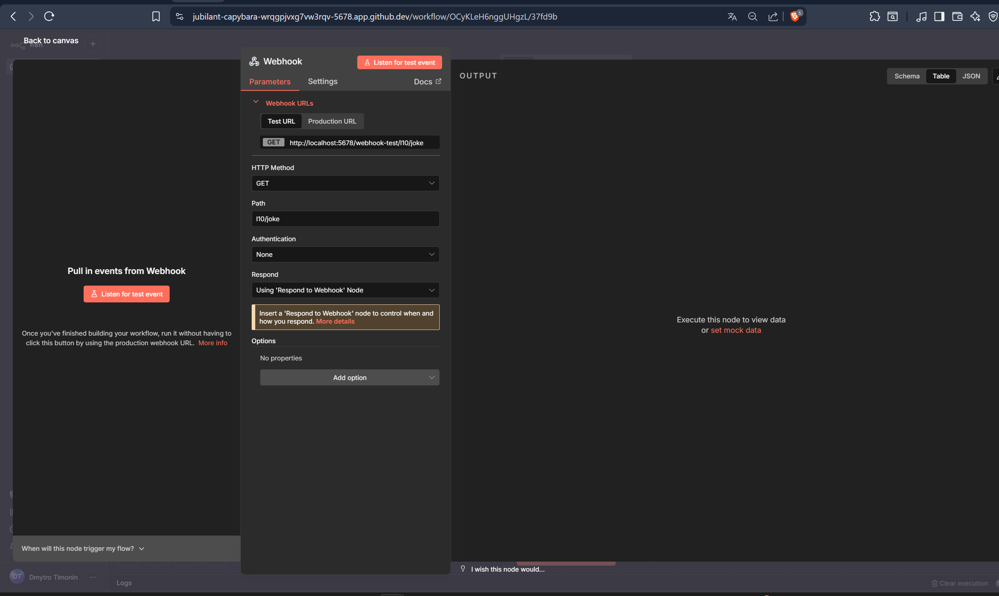
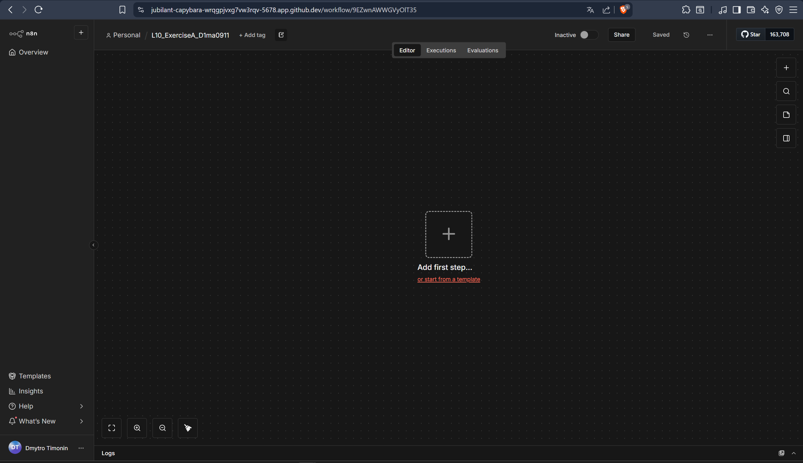
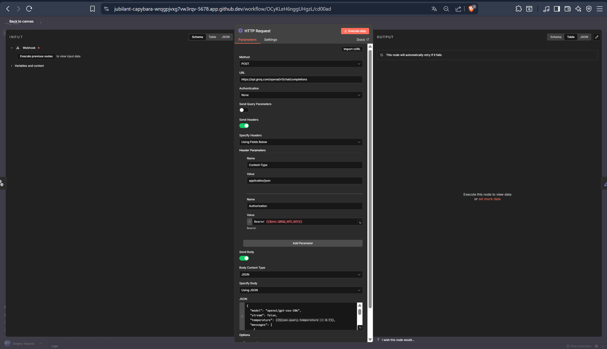
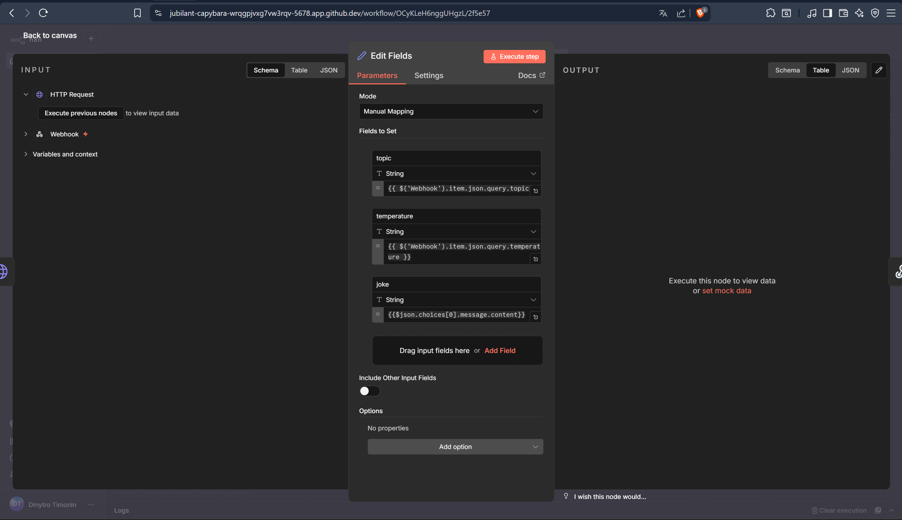
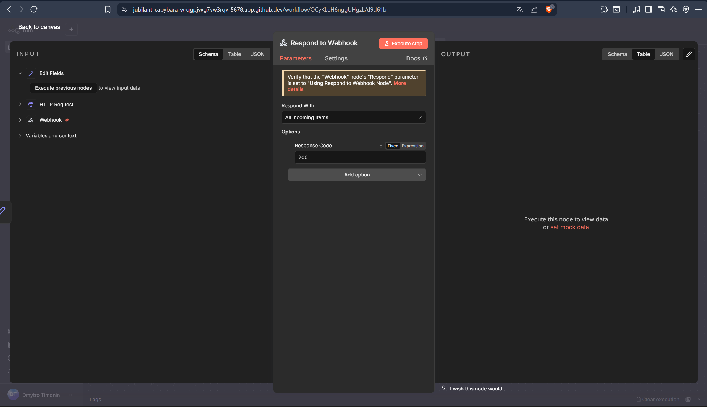
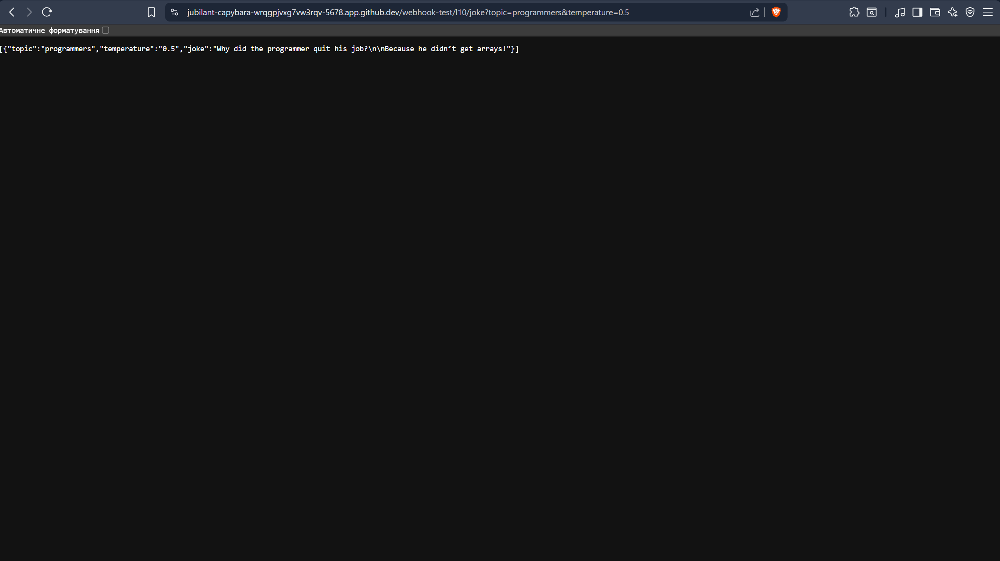

I first obtained my Groq API key from Groq.com. Then, I created a .env file in my Codespace and added GROQ_API_KEY  so n8n could use it securely.
I started a new workflow in n8n called L10_ExerciseA_D1ma0911. I added a Webhook node with GET method and path l10/joke.After that, I added an HTTP Request node to call the Groq API, using my environment variable for the API key. I set the topic, temperature, and message dynamically from the Webhook input.
I added a Set node to extract the joke and relevant info, then connected a Respond to Webhook node to return the result.Finally, I tested the workflow in the browser and got a result 