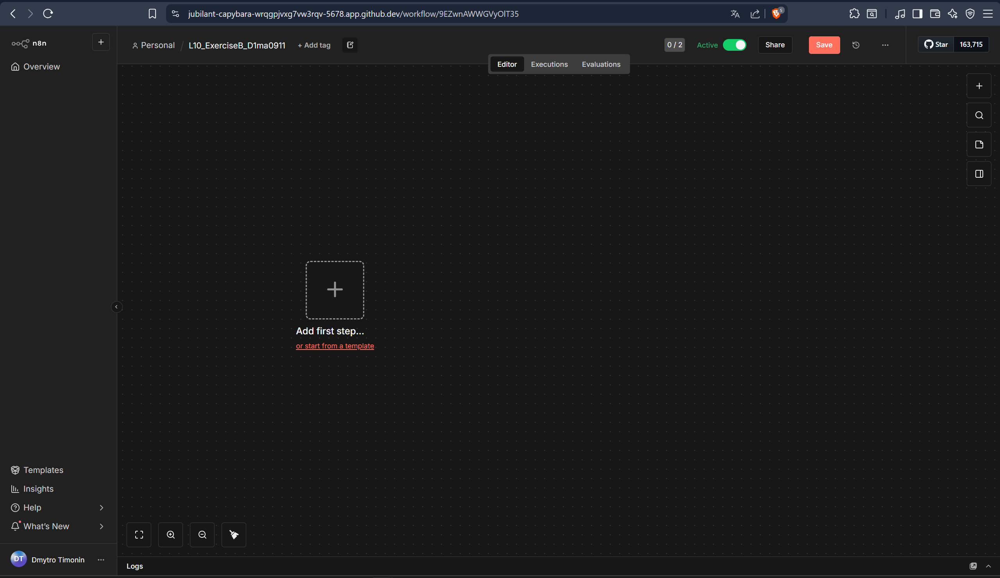
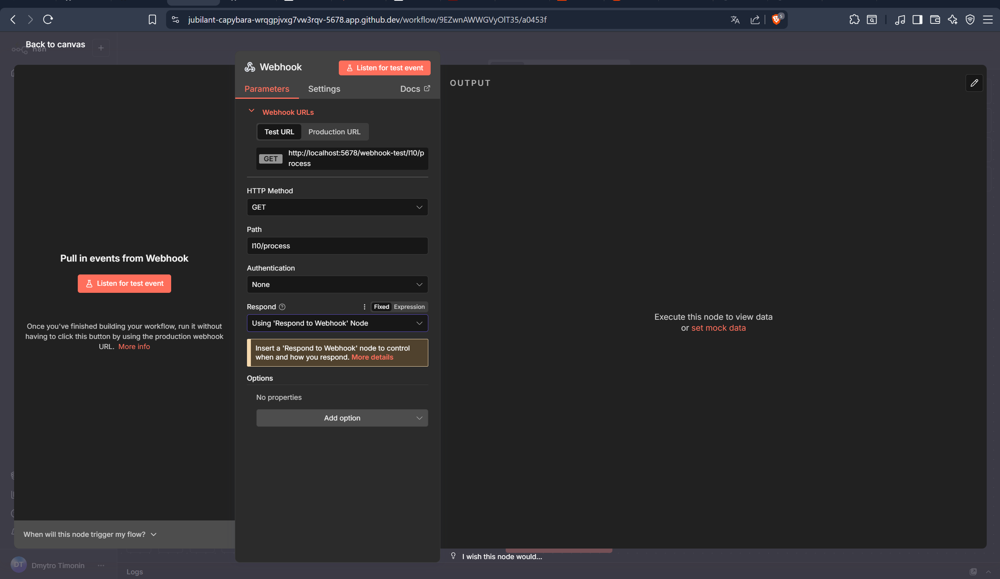
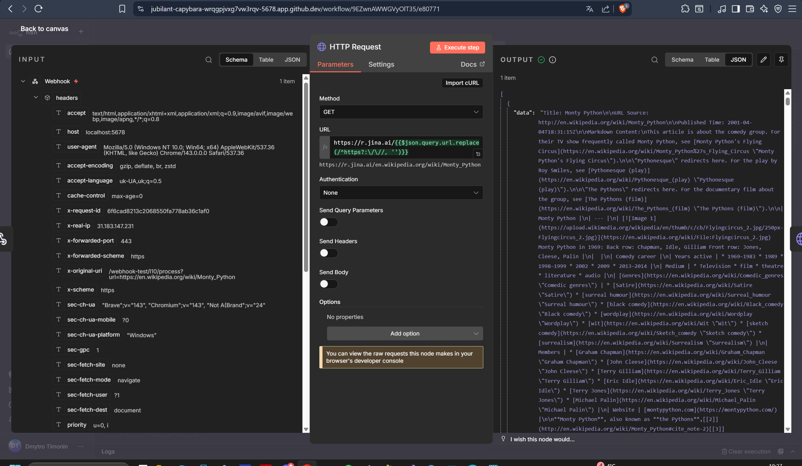
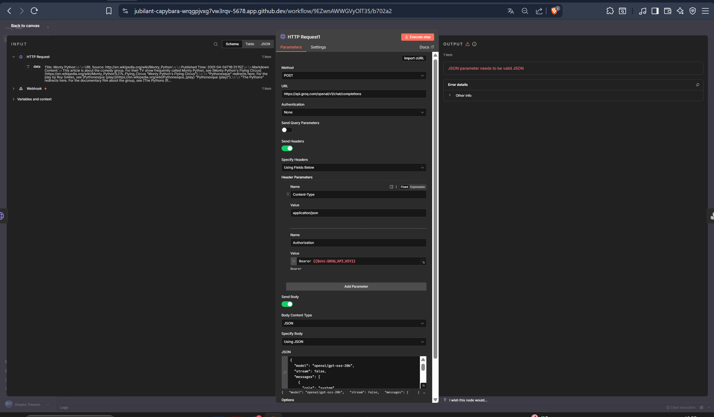
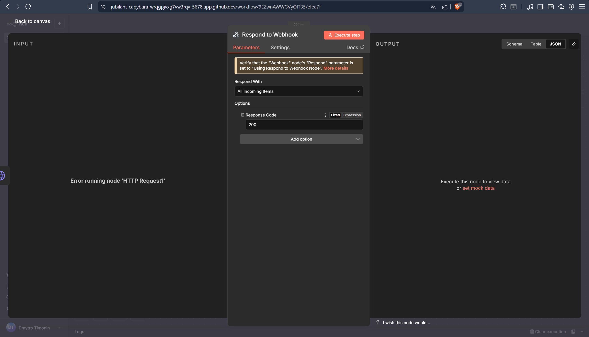

I created an n8n workflow that starts with a Webhook accepting a URL, retrieves the main content of that page using Jina.ai, and passes it to a Groq LLM. I tried to configured the LLM to return only valid JSON following the required schema, including title, short summary, key points, tags, and source URL, using null for any unknown fields.
Sadly i cant figure out a reason for the Error that keeps popping up about incorrect JSON parameter , i am working on this assigment for more than 5 hours(task A and B combined with all error fixiing i had to do) and it seams i cant figure out this problem so i uploaded all the work i did with screenshots but sadly i could not get any final result of my workflow i hope the work i did will be enough to pass those laboratories.