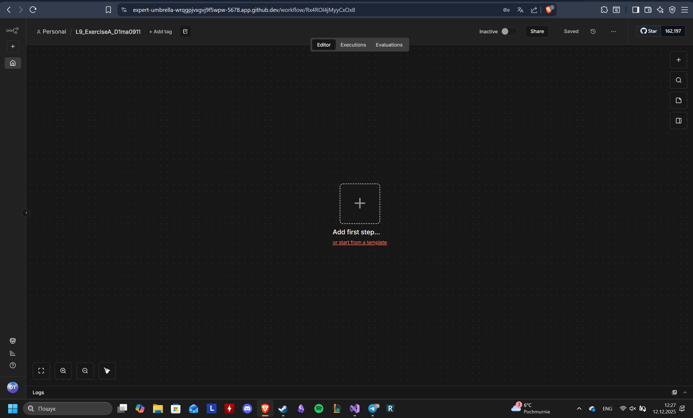
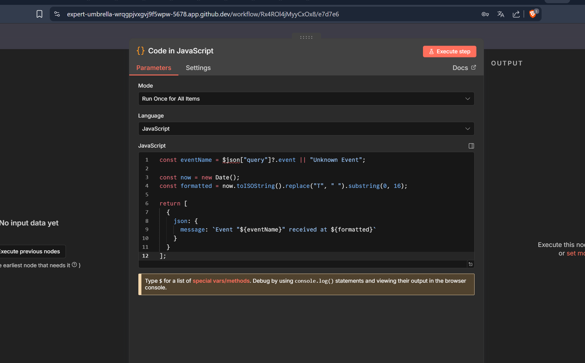
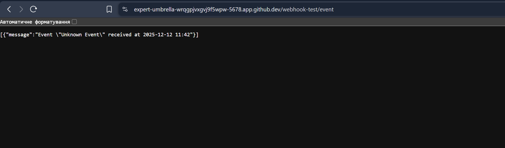
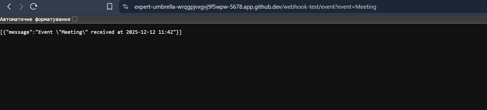
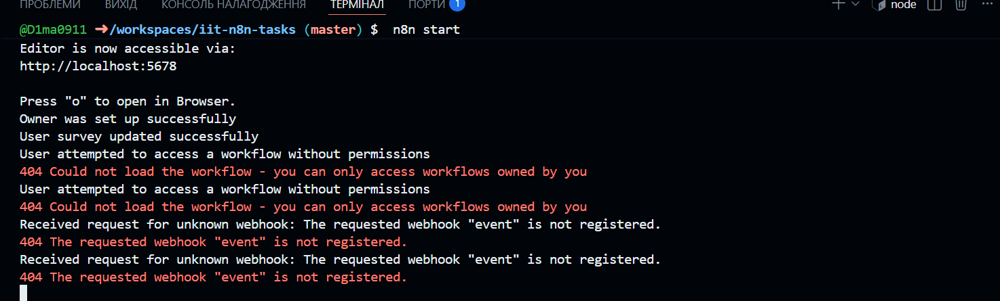

I created an n8n workflow that receives an event name through a Webhook, processes it with a Code node to generate a formatted timestamped message, and returns the result using a Respond to Webhook node. Then i tested the workflow using the test webhook URL and verified that it returns the expected JSON output and activated a workflow

