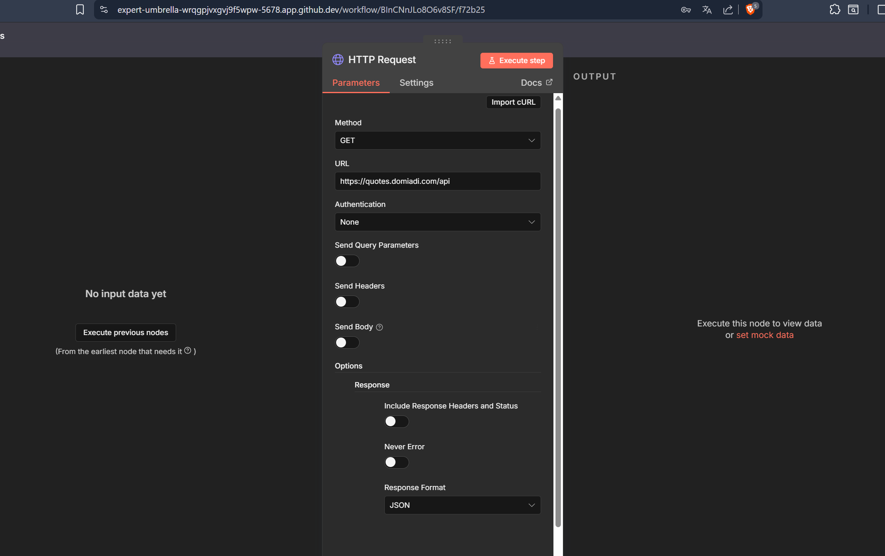
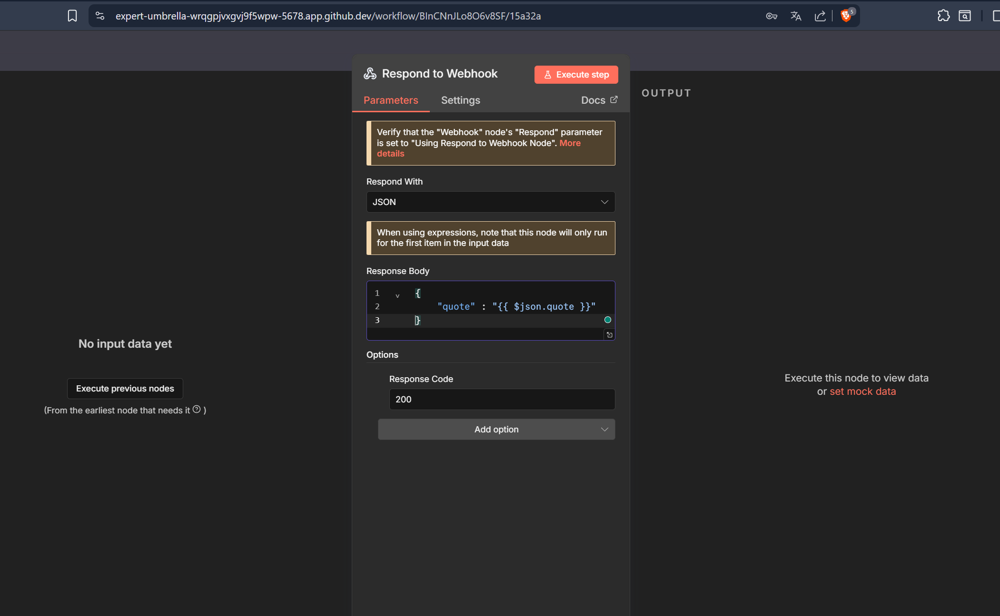
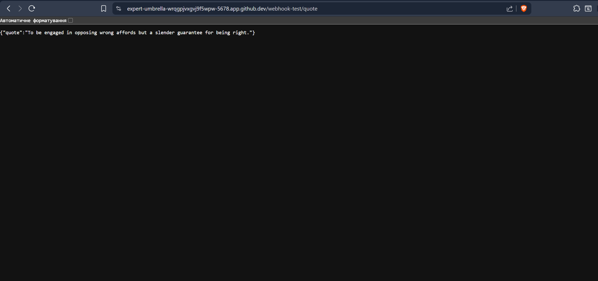
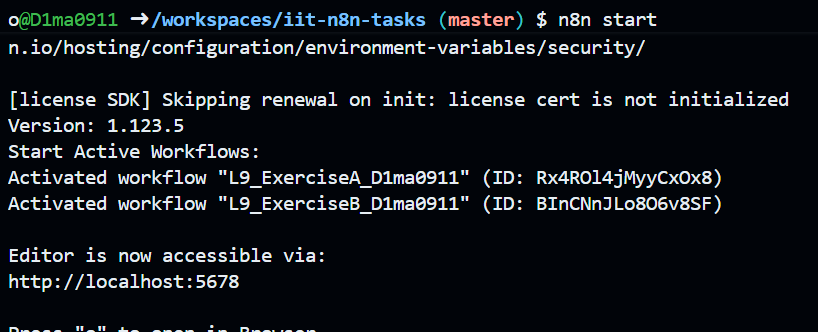

I built an n8n workflow that receives a request through a Webhook, calls an external API to fetch a random quote, and returns the result in a JSON response. The workflow uses a Webhook node to trigger the request, an HTTP Request node to retrieve the quote, and a Respond to Webhook node to send the formatted JSON back to me. After configuring everything, I tested the workflow using the test URL to confirm that the quote is correctly fetched and returned.

