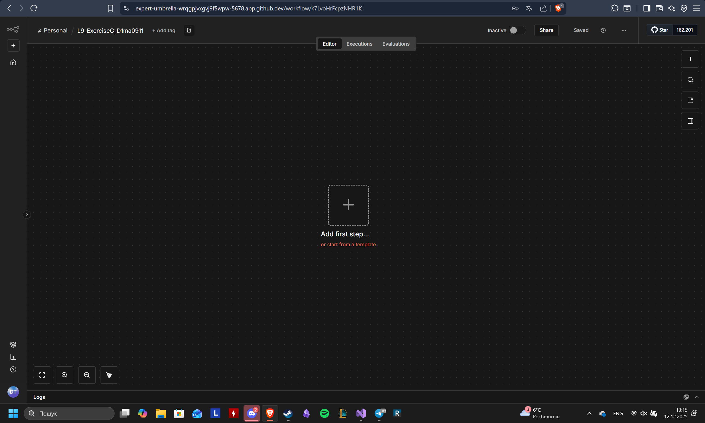
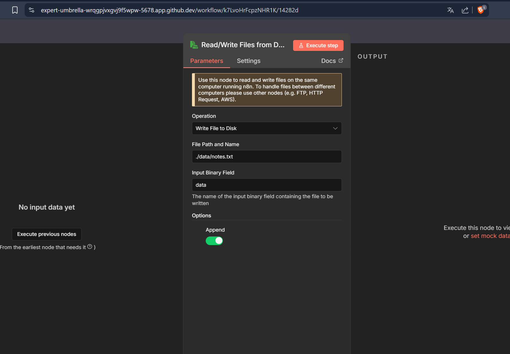
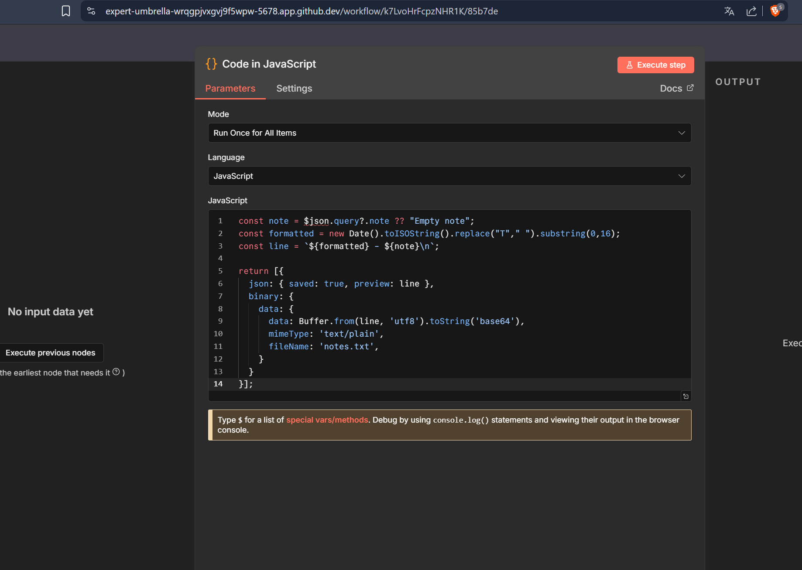
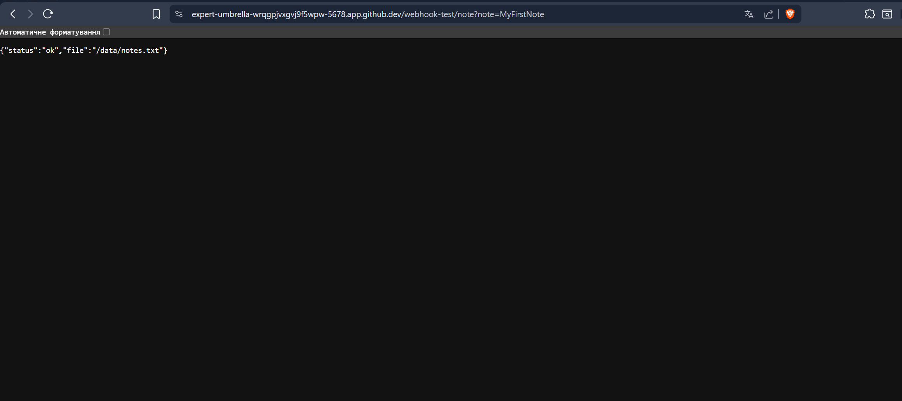
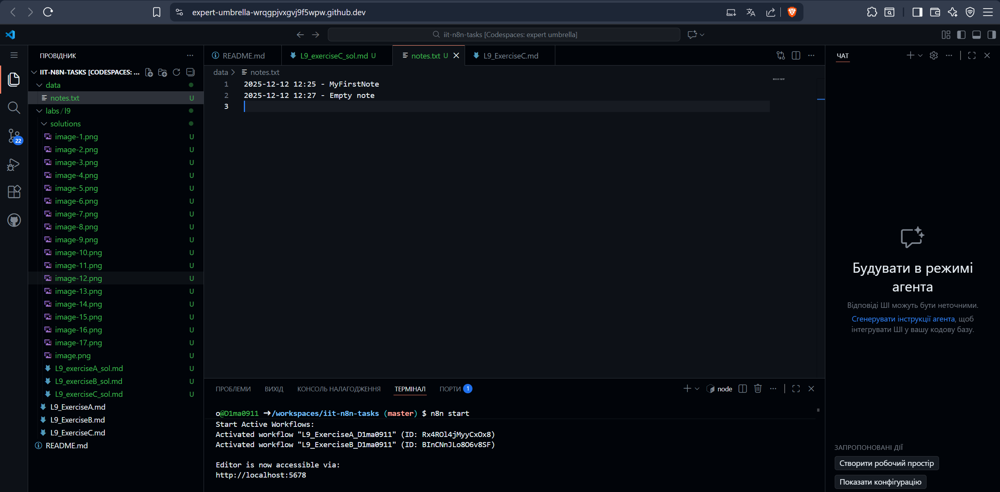

I created an n8n workflow that receives a note through a Webhook, adds a timestamp to it, and appends the formatted line to a file stored in my Codespace. Webhook node captures works with the request, Code node generates the timestamped text and convert it into binary, and Write Binary File node appends the data to ./data/notes.txt.Then I added a Respond to Webhook node so the workflow returns a confirmation JSON, and I verified the results by checking the updated notes.txt file in my Codespace.
